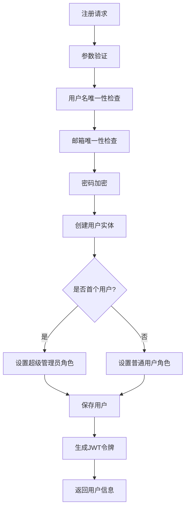
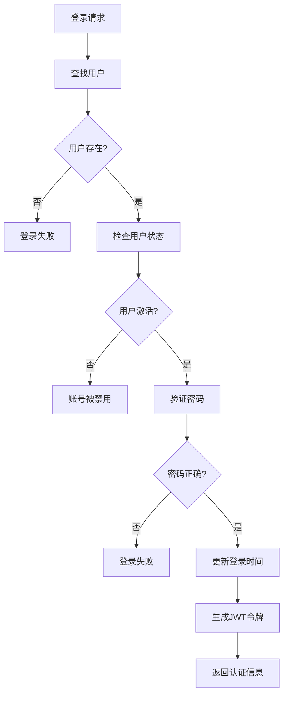
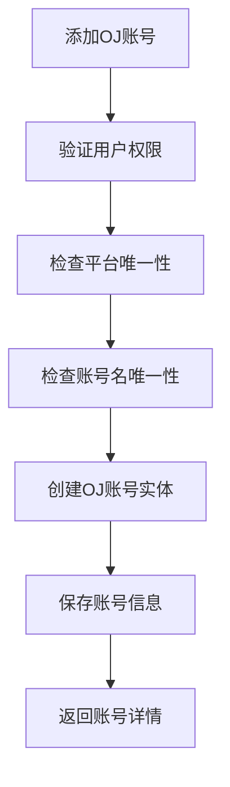

# 核心业务层架构说明

## 📋 概述

核心业务层是CodingTracker系统的核心，包含领域模型、业务逻辑和数据访问接口。采用领域驱动设计(DDD)模式，确保业务逻辑的纯净性和可测试性。

## 🏗️ 架构设计

### 目录结构
```
core/
├── domain/                 # 领域层
│   ├── entity/            # 实体类
│   │   ├── User.java           # 用户实体
│   │   ├── UserOJ.java         # OJ账号实体
│   │   ├── UserTag.java        # 用户标签实体
│   │   └── OJPlatform.java     # OJ平台枚举
│   └── repository/        # 仓储接口
│       ├── UserRepository.java      # 用户仓储接口
│       ├── UserOJRepository.java    # OJ账号仓储接口
│       └── UserTagRepository.java   # 标签仓储接口
├── service/               # 服务接口
│   ├── UserService.java         # 用户服务接口
│   ├── UserAuthService.java     # 认证服务接口
│   └── UserOJService.java       # OJ账号服务接口
├── service/impl/          # 服务实现
│   ├── UserServiceImpl.java     # 用户服务实现
│   ├── UserAuthServiceImpl.java # 认证服务实现
│   └── UserOJServiceImpl.java   # OJ账号服务实现
└── README.md             # 本文档
```

### 设计原则

1. **领域驱动设计(DDD)**：以业务领域为核心设计模型
2. **单一职责原则**：每个服务只负责特定业务领域
3. **依赖倒置**：依赖抽象而非具体实现
4. **聚合根设计**：通过聚合根管理实体生命周期
5. **业务逻辑封装**：核心业务逻辑在领域层实现

## 📊 领域模型

### 1. 用户聚合 (User Aggregate)

#### User - 用户实体（聚合根）
**职责**：用户基本信息管理和业务规则
```java
@Entity
public class User {
    private Integer id;                    // 用户ID
    private String username;               // 用户名
    private String password;               // 密码
    private String realName;              // 真实姓名
    private String email;                 // 邮箱
    private String major;                 // 专业
    private String avatar;                // 头像URL
    private boolean active;               // 是否激活
    private LocalDateTime lastTryDate;    // 最后尝试时间
    private Set<Type> roles;              // 角色集合
    private List<UserOJ> ojAccounts;      // OJ账号列表
    private Set<UserTag> tags;            // 标签集合
    
    // 业务方法
    public void activate();               // 激活用户
    public void deactivate();             // 停用用户
    public void addRole(Type role);       // 添加角色
    public boolean hasRole(Type role);    // 检查角色
    public boolean isSuperAdmin();        // 是否超级管理员
    public boolean isAdmin();             // 是否管理员
}
```

#### UserOJ - OJ账号实体
**职责**：OJ平台账号信息管理
```java
@Entity
public class UserOJ {
    private Integer id;                   // 账号ID
    private User user;                    // 所属用户
    private OJPlatform platform;          // OJ平台
    private String accountName;           // 账号名
    private boolean active;               // 是否激活
    private LocalDateTime lastSyncAt;     // 最后同步时间
    
    // 业务方法
    public void activate();               // 激活账号
    public void deactivate();             // 停用账号
    public void updateSyncTime();         // 更新同步时间
}
```

#### UserTag - 用户标签实体
**职责**：用户分类标签管理
```java
@Entity
public class UserTag {
    private Integer id;                   // 标签ID
    private String name;                  // 标签名称
    private String color;                 // 标签颜色
    private String description;           // 标签描述
    private Integer sortOrder;            // 排序顺序
    private boolean active;               // 是否激活
}
```

#### OJPlatform - OJ平台枚举
**职责**：定义支持的OJ平台
```java
public enum OJPlatform {
    CODEFORCES("CodeForces", "https://codeforces.com/"),
    LEETCODE("LeetCode", "https://leetcode.com/"),
    ATCODER("AtCoder", "https://atcoder.jp/"),
    NOWCODER("牛客网", "https://www.nowcoder.com/");
    
    private final String displayName;
    private final String baseUrl;
}
```

## 🔧 仓储接口

### 设计原则
- 基于JPA Repository模式
- 提供领域特定的查询方法
- 支持分页和排序
- 使用方法命名约定

### UserRepository
```java
public interface UserRepository extends JpaRepository<User, Integer> {
    Optional<User> findByUsername(String username);
    Optional<User> findByEmail(String email);
    boolean existsByUsername(String username);
    boolean existsByEmail(String email);
    List<User> findByRolesContains(User.Type role);
    Page<User> findAllByOrderByCreatedAtDesc(Pageable pageable);
    List<User> searchByKeyword(String keyword);
    long countByActiveTrue();
    long countByRole(User.Type role);
}
```

### UserOJRepository
```java
public interface UserOJRepository extends JpaRepository<UserOJ, Integer> {
    List<UserOJ> findByUserIdOrderByCreatedAtDesc(Integer userId);
    Optional<UserOJ> findByUserIdAndPlatform(Integer userId, OJPlatform platform);
    boolean existsByUserIdAndPlatform(Integer userId, OJPlatform platform);
    boolean existsByPlatformAndAccountName(OJPlatform platform, String accountName);
    List<UserOJ> findByPlatformAndActiveTrue(OJPlatform platform);
    int deleteByUserId(Integer userId);
    long countByPlatform(OJPlatform platform);
}
```

### UserTagRepository
```java
public interface UserTagRepository extends JpaRepository<UserTag, Integer> {
    Optional<UserTag> findByName(String name);
    boolean existsByName(String name);
    List<UserTag> findByActiveTrueOrderBySortOrderAsc();
    List<UserTag> findByNameContainingIgnoreCase(String name);
}
```

## 🛠️ 服务层

### 1. UserService - 用户服务
**职责**：用户生命周期管理

**核心方法**：
- `createUser(UserCreateRequest)` - 创建用户
- `updateUser(Integer, UserUpdateRequest)` - 更新用户
- `deleteUser(Integer)` - 删除用户
- `findByUsername(String)` - 按用户名查找
- `getAllUsers(Pageable)` - 分页获取用户列表
- `searchUsers(String)` - 搜索用户
- `uploadAvatar(String, MultipartFile)` - 上传头像

**业务规则**：
- 用户名唯一性检查
- 邮箱唯一性检查
- 第一个用户自动成为超级管理员
- 删除用户时级联删除关联数据

### 2. UserAuthService - 认证服务
**职责**：用户认证和授权

**核心方法**：
- `login(LoginRequest)` - 用户登录
- `register(RegisterRequest)` - 用户注册
- `changePassword(String, PasswordChangeRequest)` - 修改密码
- `resetPassword(String, String)` - 重置密码
- `validateToken(String)` - 验证令牌
- `refreshToken(String)` - 刷新令牌

**业务规则**：
- 密码强度验证
- 登录失败次数限制
- JWT令牌生成和验证
- 用户状态检查

### 3. UserOJService - OJ账号服务
**职责**：OJ账号管理

**核心方法**：
- `addOJAccount(String, OJAccountRequest)` - 添加OJ账号
- `updateOJAccount(Integer, OJAccountRequest)` - 更新OJ账号
- `deleteOJAccount(Integer)` - 删除OJ账号
- `getUserOJAccounts(String)` - 获取用户OJ账号列表
- `getOJAccountsByPlatform(OJPlatform)` - 按平台获取账号

**业务规则**：
- 每个用户每个平台只能有一个账号
- 账号名在平台内唯一
- 账号状态管理
- 同步时间更新

## 📈 业务流程

### 1. 用户注册流程


### 2. 用户登录流程


### 3. OJ账号管理流程


## 🔍 数据验证

### 实体级验证
```java
@Entity
public class User {
    @Column(unique = true, nullable = false, length = 20)
    @Pattern(regexp = "^[a-zA-Z0-9_]+$", message = "用户名只能包含字母、数字和下划线")
    private String username;
    
    @Column(unique = true, nullable = false, length = 100)
    @Email(message = "邮箱格式不正确")
    private String email;
    
    @Column(nullable = false, length = 20)
    @Size(min = 2, max = 20, message = "真实姓名长度应在2-20字符之间")
    private String realName;
}
```

### 服务级验证
```java
@Service
public class UserServiceImpl implements UserService {
    
    private void validateCreateRequest(UserCreateRequest request) {
        if (!request.isPasswordMatch()) {
            throw ValidationException.passwordMismatch();
        }
        
        if (request.getRoles() != null && 
            request.getRoles().contains(User.Type.SUPER_ADMIN)) {
            throw new ValidationException("不允许通过API创建超级管理员用户");
        }
    }
}
```

## 🔐 安全考虑

### 密码处理
- 使用BCrypt加密存储密码
- 密码强度验证（至少8位，包含字母和数字）
- 敏感信息不返回给客户端

### 权限控制
- 基于角色的访问控制(RBAC)
- 方法级权限验证
- 资源所有者权限检查

### 数据保护
- 个人敏感信息加密存储
- 审计日志记录
- 数据访问监控

## 🧪 测试策略

### 单元测试
```java
@ExtendWith(MockitoExtension.class)
class UserServiceImplTest {
    
    @Mock
    private UserRepository userRepository;
    
    @InjectMocks
    private UserServiceImpl userService;
    
    @Test
    void createUser_Success() {
        // Given
        UserCreateRequest request = new UserCreateRequest();
        request.setUsername("testuser");
        request.setPassword("password123");
        request.setEmail("test@example.com");
        
        when(userRepository.existsByUsername("testuser")).thenReturn(false);
        when(userRepository.existsByEmail("test@example.com")).thenReturn(false);
        
        // When & Then
        assertThat(userService.createUser(request)).isNotNull();
    }
}
```

### 集成测试
```java
@SpringBootTest
@Transactional
class UserServiceIntegrationTest {
    
    @Autowired
    private UserService userService;
    
    @Test
    void createUser_WithRealDatabase() {
        // 完整的集成测试
    }
}
```

## 📊 性能优化

### 数据库优化
- 合理使用索引
- 查询优化
- 分页查询
- 批量操作

### 缓存策略
- 用户信息缓存
- 权限信息缓存
- 查询结果缓存

### 事务管理
- 合理的事务边界
- 只读事务优化
- 事务超时设置

## 📝 开发指南

### 1. 添加新实体
```java
@Entity
@Table(name = "your_table")
@Data
@Builder
@NoArgsConstructor
@AllArgsConstructor
public class YourEntity extends BaseEntity {
    
    @Id
    @GeneratedValue(strategy = GenerationType.IDENTITY)
    private Integer id;
    
    // 添加字段和业务方法
}
```

### 2. 添加新服务
```java
public interface YourService {
    // 定义服务接口
}

@Service
@Transactional
@RequiredArgsConstructor
@Slf4j
public class YourServiceImpl implements YourService {
    
    private final YourRepository yourRepository;
    
    // 实现服务方法
}
```

### 3. 添加业务验证
```java
private void validateYourRequest(YourRequest request) {
    if (/* 验证条件 */) {
        throw new ValidationException("验证失败消息");
    }
}
```

## 📈 监控指标

### 业务指标
- 用户注册量
- 用户活跃度
- OJ账号数量
- 操作成功率

### 技术指标
- 服务响应时间
- 数据库查询性能
- 事务成功率
- 异常发生率

## 🚨 注意事项

1. **事务管理**：确保数据一致性，合理使用事务
2. **异常处理**：使用业务异常，提供明确的错误信息
3. **参数验证**：在服务层进行业务规则验证
4. **日志记录**：记录关键业务操作和异常
5. **性能考虑**：避免N+1查询，合理使用缓存
6. **代码质量**：保持高内聚低耦合，编写可测试的代码 